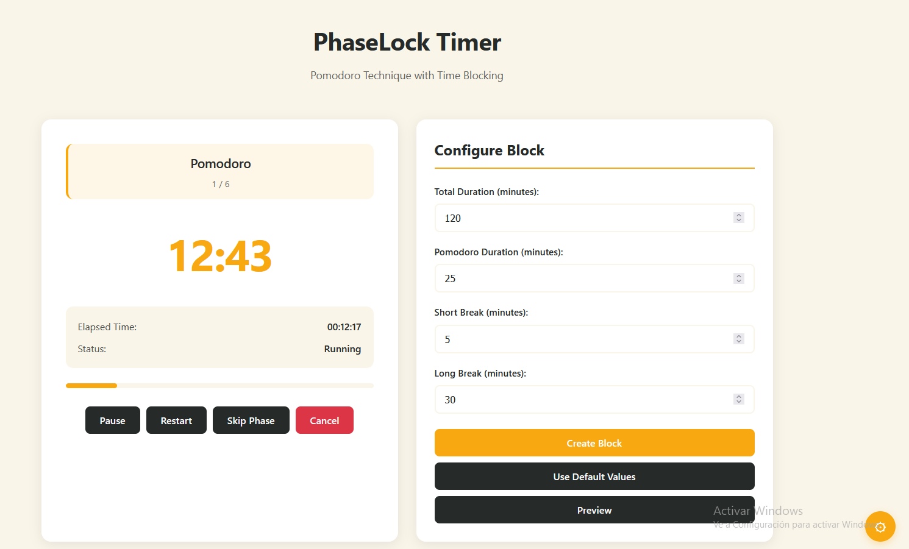
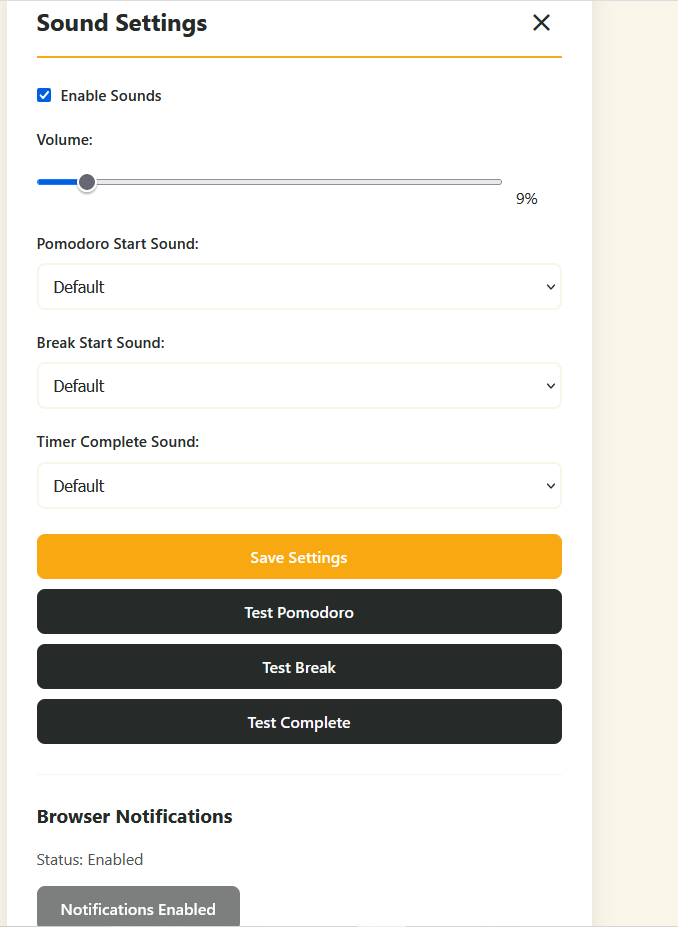

# PhaseLock Timer

Productivity application that combines the Pomodoro technique with time blocking. Create customizable time blocks with automatic Pomodoro sequence calculation, real-time timer control, and comprehensive notification system.

## Features

### Time Block Management
- Create time blocks with customizable total duration (default: 2 hours)
- Configure Pomodoro duration (default: 25 minutes)
- Set short break duration (default: 5 minutes)
- Set long break duration (default: 30 minutes)
- Automatic calculation of complete Pomodoro sequences

### Timer Control
- Start, pause, resume, and restart timer
- Skip to next phase manually
- Cancel current block
- Real-time updates via WebSocket
- Automatic phase transitions

### Display & Interface
- Real-time timer display with remaining time (MM:SS format)
- Current phase indicator (Pomodoro / Short Break / Long Break)
- Overall block progress visualization
- Total elapsed time tracking
- Dynamic color coding based on current phase
- Browser tab title updates with timer status

### Notifications & Alerts
- Audible notifications with 2-second melodies on phase changes
- Browser notifications when app is in background
- Visual effects (blink/highlight) on phase changes
- Customizable sound settings
- Volume control
- Notification permission management

## Technology Stack

- **Backend:** Spring Boot 4.0.0, Java 21
- **Database:** H2 (in-memory)
- **Frontend:** HTML5, CSS3, JavaScript (ES6+)
- **Real-time:** WebSocket (STOMP over SockJS)
- **Build Tool:** Maven

## Prerequisites

- Java 21 or higher
- Maven 3.6+ (or use included Maven Wrapper)

## Getting Started

### Installation

1. Clone the repository:
```bash
git clone https://github.com/andrexocampo/PhaseLock-timer.git
cd PhaseLock-timer
```

2. Build the project:
```bash
./mvnw clean install
```

### Running the Application

Start the application using Maven:
```bash
./mvnw spring-boot:run
```

Or on Windows:
```bash
mvnw.cmd spring-boot:run
```

The application will be available at `http://localhost:8080`

### Access H2 Console

The H2 database console is available at:
```
http://localhost:8080/h2-console
```

**Connection details:**
- JDBC URL: `jdbc:h2:mem:phaselockdb`
- Username: `sa`
- Password: (leave empty)

## Usage

### Creating a Time Block

1. Configure your time block settings:
   - Total duration (minutes)
   - Pomodoro duration (minutes)
   - Short break duration (minutes)
   - Long break duration (minutes)

2. Click "Create Block" or use "Use Default Values"

3. Preview the calculated sequence before creating

### Using the Timer

1. Create or select a time block
2. Click "Start" to begin the timer
3. The timer will automatically progress through phases:
   - Pomodoro sessions
   - Short breaks between pomodoros
   - Long break at the end

4. Use controls to:
   - Pause/Resume the timer
   - Restart the current block
   - Skip to the next phase
   - Cancel the timer

### Customizing Notifications

1. Click the settings button (bottom right)
2. Configure sound preferences:
   - Enable/disable sounds
   - Adjust volume
   - Test different sounds
3. Enable browser notifications for background alerts

## API Endpoints

### Block Management

- `POST /api/blocks` - Create a new time block
- `POST /api/blocks/default` - Create block with default values
- `GET /api/blocks/{id}` - Get block by ID with sequence
- `GET /api/blocks` - Get all blocks
- `POST /api/blocks/preview` - Preview sequence without creating
- `GET /api/blocks/defaults` - Get default configuration values

### Timer Control

- `POST /api/timer/start/{blockId}` - Start timer for a block
- `POST /api/timer/{sessionId}/pause` - Pause the timer
- `POST /api/timer/{sessionId}/resume` - Resume the timer
- `POST /api/timer/{sessionId}/restart` - Restart the block
- `POST /api/timer/{sessionId}/skip` - Skip to next phase
- `DELETE /api/timer/{sessionId}` - Cancel the timer
- `GET /api/timer/{sessionId}` - Get timer status
- `GET /api/timer/active` - Get active session

### WebSocket

- Endpoint: `/ws`
- Topic: `/topic/timer/{sessionId}` - Real-time timer updates

## Project Structure

```
src/
├── main/
│   ├── java/
│   │   └── com/portafolio/PhaseLock_timer/
│   │       ├── config/          # Configuration classes
│   │       ├── controller/      # REST controllers
│   │       ├── dto/             # Data Transfer Objects
│   │       ├── exception/       # Exception handlers
│   │       ├── model/           # Entity models
│   │       ├── repository/      # JPA repositories
│   │       └── service/         # Business logic
│   └── resources/
│       ├── static/             # Frontend files (HTML, CSS, JS)
│       └── application.properties
└── test/                        # Test files
```

## Default Configuration

- **Total Duration:** 120 minutes (2 hours)
- **Pomodoro Duration:** 25 minutes
- **Short Break:** 5 minutes
- **Long Break:** 30 minutes

## Browser Compatibility

- Chrome/Edge (recommended)
- Firefox
- Safari
- Opera

**Note:** Browser notifications require user permission. The app will request permission on first load.

## Development

### Branching Strategy

- `main` - Production-ready code
- `develop` - Development branch

### Building

```bash
./mvnw clean package
```

### Running Tests

```bash
./mvnw test
```

## License

MIT License - see LICENSE file for details

## Screenshots

### Main Interface with Timer Running


### Settings Panel


### Block Sequence Preview


## Contributing

Contributions are welcome! Please feel free to submit a Pull Request.

## Author

Andres Ocampo

## Acknowledgments

- Built with Spring Boot
- Inspired by the Pomodoro Technique by Francesco Cirillo
